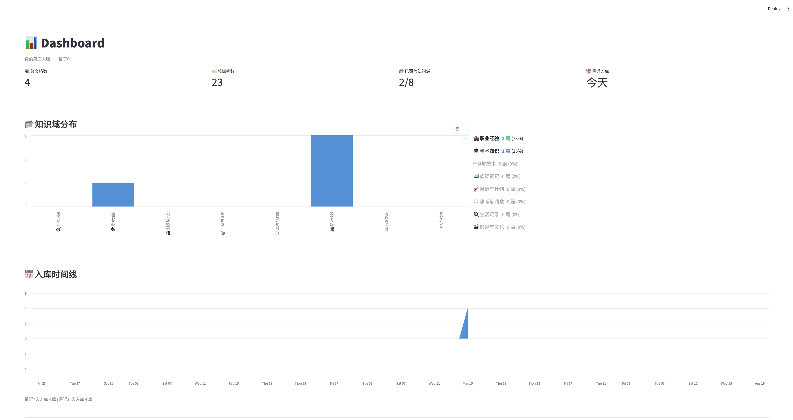
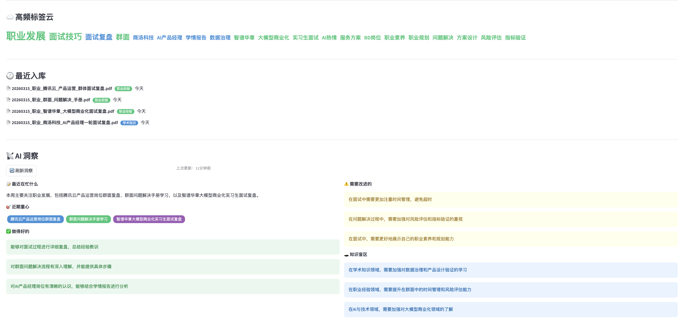
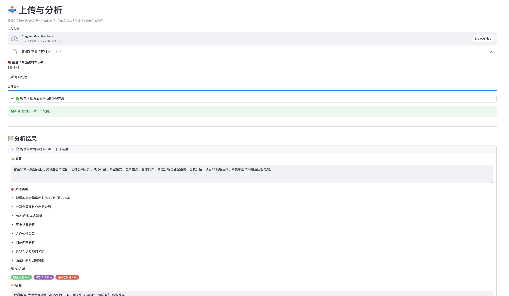
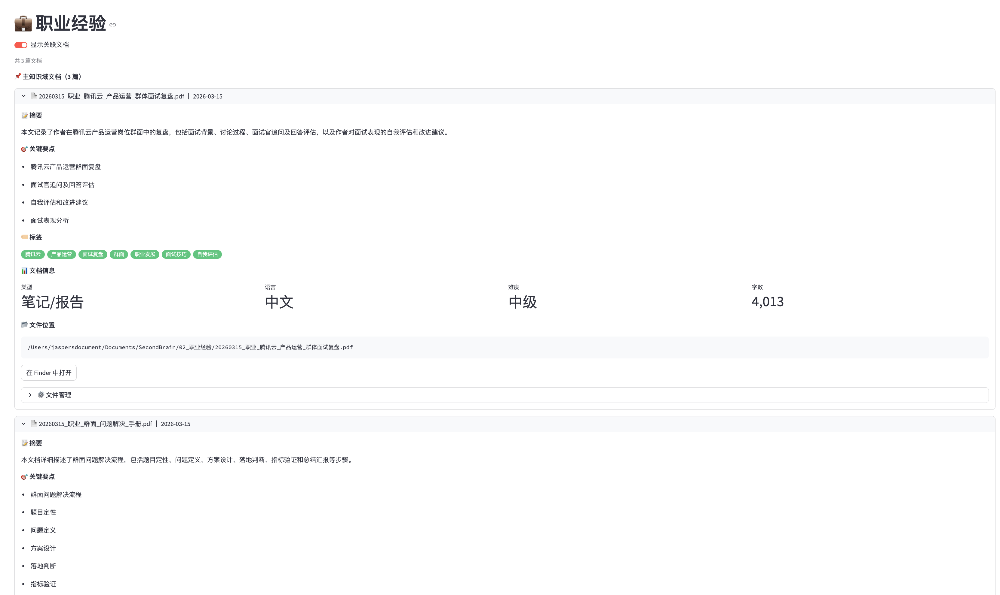

<div align="center">

# 📚 文档智能入库助手

**基于智谱GLM大模型的个人知识库文档入库与管理工具**

将散乱文档自动转化为结构化知识条目，为你的「第二大脑」提供标准化入库流程

[](https://python.org)
[](https://streamlit.io)
[](https://open.bigmodel.cn/)
[](https://claude.ai)
[](LICENSE)

</div>

---

## ✨ 功能亮点

🤖 **AI智能分析** — 上传文档，自动生成摘要、知识域分类（8大领域）、结构化标签，支持PDF/Markdown/TXT

📁 **本地文件管理** — AI建议标准化文件名，一键入库到本地知识库文件夹，支持重命名、跨域移动、删除

📊 **Dashboard全局视图** — 知识域分布、入库时间线、高频标签云、最近入库文档一览

📡 **AI驱动洞察** — 基于全部文档元数据，LLM自动分析你最近在忙什么、做得好的、需要改进的、知识盲区

🏷️ **智能命名规则** — 日期_知识域_主题_文档类型 格式，自动识别面试复盘、竞品分析等文档类型

🔄 **主域/关联域分离** — 每篇文档一个主知识域 + 多个关联域，默认显示主域文档，可切换查看关联文档

---

## 📸 界面预览

### Dashboard — 知识库全局视图



### AI 洞察 — LLM驱动的个人分析



### 上传与分析 — 文档入库核心流程



### 知识域页面 — 按领域浏览与管理



---

## 🏗️ 系统架构

```
┌──────────────────────────────────────────────┐
│         Streamlit 多页应用（10个页面）          │
│  Dashboard │ 上传分析 │ 8个知识域页面           │
├──────────────────────────────────────────────┤
│                业务逻辑层                      │
│  文档解析 │ AI分析 │ 文件管理 │ 元数据 │ Memory │
├──────────────────────────────────────────────┤
│  智谱 GLM-4-FlashX API                       │
├──────────────────────────────────────────────┤
│  ~/Documents/SecondBrain/                     │
│  ├── metadata.json    ← 全部文档元数据         │
│  ├── memory.json      ← AI洞察持久化          │
│  └── 01~08 知识域文件夹 ← 实际文件存储          │
└──────────────────────────────────────────────┘
```

---

## 🚀 快速开始

### 前置条件

- Python 3.8+
- [智谱AI API Key](https://open.bigmodel.cn/)（注册即可获取免费额度）

### 安装

```bash
# 克隆项目
git clone https://github.com/Ddddd917/doc-ingestion-tool.git
cd doc-ingestion-tool

# 安装依赖
pip install -r requirements.txt

# 配置 API Key
cp .env.example .env
# 编辑 .env 文件，填入你的智谱 API Key
```

### 运行

```bash
streamlit run app.py
```

浏览器自动打开 http://localhost:8501 ，开始使用。

首次启动会自动在 ~/Documents/SecondBrain/ 下创建8个知识域文件夹。

---

## 📂 项目结构

```
doc-ingestion-tool/
├── app.py                      # 主入口：多页导航 + 侧边栏
├── pages/
│   ├── dashboard.py            # 📊 Dashboard（默认首页）
│   ├── upload.py               # 📤 上传与分析
│   ├── academic.py             # 🎓 学术知识
│   ├── career.py               # 💼 职业经验
│   ├── ai_tech.py              # 🤖 AI与技术
│   ├── reading.py              # 📖 阅读笔记
│   ├── goals.py                # 🎯 目标与计划
│   ├── insights.py             # 💭 思考与洞察
│   ├── life.py                 # 🍳 生活记录
│   └── culture.py              # 🎬 影视与文化
├── core/
│   ├── config.py               # 知识库配置与初始化
│   ├── llm_client.py           # 智谱GLM API封装
│   ├── doc_parser.py           # 文档解析（PDF/MD/TXT）
│   ├── doc_analyzer.py         # AI分析引擎
│   ├── file_manager.py         # 文件命名与归档
│   ├── metadata_store.py       # 元数据CRUD
│   ├── memory_manager.py       # AI洞察与Memory
│   ├── domain_page.py          # 知识域通用页面
│   └── exporter.py             # 导出引擎
├── screenshots/                # 界面截图
├── requirements.txt
├── .env.example
└── .gitignore
```

---

## 🎨 知识域体系

| 知识域 | Emoji | 本地文件夹 | 主题色 |
|:------:|:-----:|:---------:|:-----:|
| 学术知识 | 🎓 | 01_学术知识 | 🔵 #4A90D9 |
| 职业经验 | 💼 | 02_职业经验 | 🟢 #50C878 |
| AI与技术 | 🤖 | 03_AI与技术 | 🟣 #9B59B6 |
| 阅读笔记 | 📖 | 04_阅读笔记 | 🟠 #E67E22 |
| 目标与计划 | 🎯 | 05_目标与计划 | 🔴 #E74C3C |
| 思考与洞察 | 💭 | 06_思考与洞察 | 🔵 #1ABC9C |
| 生活记录 | 🍳 | 07_生活记录 | 🩷 #FF69B4 |
| 影视与文化 | 🎬 | 08_影视与文化 | 🟡 #F1C40F |

---

## 🔧 核心工作流

```
上传文档（PDF/MD/TXT）
      ↓
  AI 自动分析
  ├── 生成100字摘要
  ├── 识别知识域（支持多域，含置信度）
  ├── 提取3-8个结构化标签
  └── 判断文档类型/语言/难度
      ↓
  生成标准化文件名建议
  例：20260315_职业_商汤科技_AI产品经理_面试复盘.pdf
      ↓
  用户确认/修改 → 一键入库
  ├── 文件移动到对应知识域文件夹
  ├── 元数据写入 metadata.json
  └── 自动更新 AI 洞察
      ↓
  在知识域页面浏览、管理
  ├── 查看摘要/标签/关键要点
  ├── 重命名 / 跨域移动 / 删除
  └── 标签云统计
```

---

## 🛠️ 开发方式

本项目全程使用 **[Claude Code](https://claude.ai)** 以 **Vibe Coding** 方式开发——由AI生成全部代码，开发者负责产品设计、Prompt编写和测试验证。

**零手写代码，从空目录到完整应用约3小时。**

开发分为8个迭代阶段：

| 阶段 | 内容 |
|------|------|
| 1 | 项目骨架：目录结构、API封装、文档解析 |
| 2 | 核心功能：AI分析引擎 + 单页应用 |
| 3 | 架构升级：多页应用 + 本地文件管理 |
| 4 | 知识域页面：通用渲染 + 文件操作（重命名/移动/删除） |
| 5 | 命名优化：增加文档类型维度 |
| 6 | 关联文档：主域/关联域显示分离 |
| 7 | Dashboard：数据统计6大板块 |
| 8 | AI洞察：Memory持久化 + 自动更新 |

---

## 📋 未来规划

- [ ] 全局搜索（跨知识域，按标签/关键词/摘要内容）
- [ ] 向量数据库集成（ChromaDB，语义检索）
- [ ] 更多文件格式（DOCX、XLSX、图片OCR）
- [ ] 批量入库（扫描本地文件夹）
- [ ] 知识图谱可视化（标签关联关系）

---

## 📄 License

MIT License

---

<div align="center">

**Built with ❤️ by [Jasper Dai](https://github.com/Ddddd917) using Claude Code**

</div>
